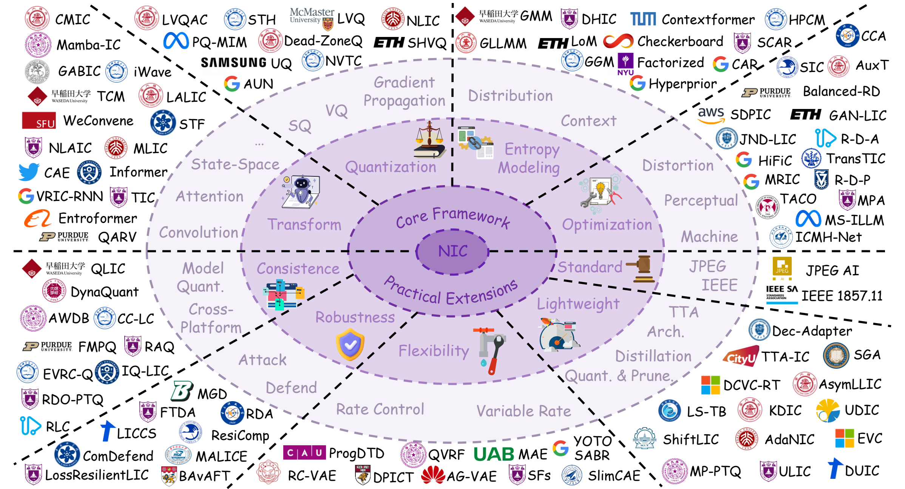
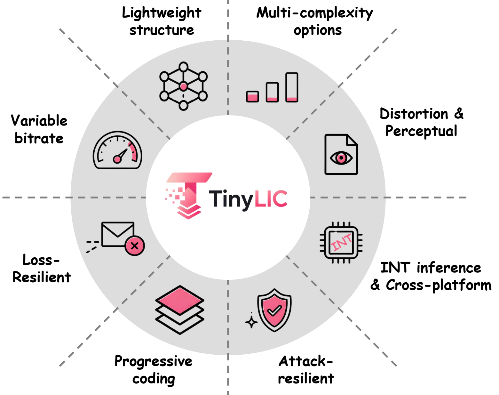

# Awesome End-to-End Neural Image Coding [](https://awesome.re)

<a id="survey"></a>

<p align="center">
  <a href="#survey"></a>
  <a href="https://njuvision.github.io/TinyLIC/LIC_survey_v1.pdf"></a>
  <a href="https://github.com/NJUVISION/TinyLIC/tree/main/tinylic"></a>
  <a href="#contributing"></a>
  <a href="https://njuvision.github.io/TinyLIC/"></a>
</p>

This repository accompanies the survey **End-to-End Neural Image Coding: Foundation, Evolution, Deployment, and Outlook**. The paper draft is available here: [LIC_survey_v1.pdf](https://njuvision.github.io/TinyLIC/LIC_survey_v1.pdf).

The page first highlights the TinyLIC benchmark, then lists papers by survey section.

<table>
  <tr>
    <td width="58%" align="center">
      <a href="figs/fig2.pdf">
        
      </a>
      <br>
      <sub><b>Figure 2.</b> Core technique taxonomy for end-to-end learned image coding</sub>
    </td>
    <td width="42%" align="center">
      <a href="figs/fig8.pdf">
        
      </a>
      <br>
      <sub><b>Figure 8.</b> TinyLIC benchmark overview</sub>
    </td>
  </tr>
</table>


<a id="table-of-contents"></a>

## 00 | Table of Contents

- [TinyLIC and Benchmark](#tinylic-and-benchmark)
- [Core Framework](#core-framework)
  - [Transform](#transform)
  - [Quantization](#quantization)
  - [Entropy Modeling](#entropy-modeling)
  - [Rate-Distortion Optimization](#rate-distortion-optimization)
- [Practical Extensions](#practical-extensions)
  - [Variable-Rate Coding and Rate Control](#variable-rate-coding-and-rate-control)
  - [Model Quantization and Cross-Platform Consistence](#model-quantization-and-cross-platform-consistence)
  - [Model Robustness](#model-robustness)
  - [Lightweight Deployment](#lightweight-deployment)
  - [Standardization Progress](#standardization-progress)
- [Citation](#citation)
- [Contributing](#contributing)

---

<a id="tinylic-and-benchmark"></a>

## 01 | TinyLIC and Benchmark

Code links point to confirmed public repositories when available; otherwise `-` indicates that no reliable open-source implementation was found during this pass.

> **TinyLIC** is the open benchmark centerpiece of this survey: a transparent, efficient, and extensible reference codec for studying practical learned image compression.


<a id="tinylic-design"></a>

### 1.1 | TinyLIC Design

| Component | Description |
|:--|:--|
| Backbone | Lightweight VAE-based transform coding framework |
| Main block | Efficient depth-wise ConvNeXt-style EDN block |
| Entropy model | Lightweight 4-step channel autoregressive Gaussian model |
| Complexity levels | Nano, Small, and Base at roughly 10, 20, and 50 KMACs/pixel |
| Optimization | Objective Fidelity-oriented and Perceptual Realism-oriented variants |
| Practical tools | Variable-rate control, INT8 consistent decoding, attack-resilient training, progressive coding, and loss-resilient coding |

<a id="tinylic-results"></a>

### 1.2 | TinyLIC Results

| TinyLIC Variant | Dec. KMACs/pixel | Params | Kodak PSNR BD-rate vs. VTM | CLIC PSNR BD-rate vs. VTM | Tecnick PSNR BD-rate vs. VTM |
|:--|--:|--:|--:|--:|--:|
| Nano | 10 | 3.16M | 14.78 | 14.68 | 12.76 |
| Small | 20 | 4.76M | 5.43 | 4.63 | 2.73 |
| Base | 50 | 10.57M | -0.79 | -1.76 | -4.21 |
| + VR | 50 | - | -1.50 | -2.75 | -5.02 |
| + VR + INT8 | 50 | -| -0.41 | -1.45 | -3.68 |
| + VR + INT8 + Progressive | 50 | - | 3.15 | -1.04 | -1.71 |
| + VR + INT8 + Attack-Resilient | 50 | - | -0.20 | -1.36 | -3.36 |
| + VR + INT8 + Loss-Resilient | 50 | - | 9.69 | 8.54 | 6.01 |

Lower BD-rate is better. VTM 22.0 is used as the anchor for distortion-oriented evaluation.

<a id="benchmark-and-evaluation"></a>

### 1.3 | Benchmark and Evaluation

| Method | Pub. | Arch. | Context | Params | KMACs/pixel | BD-rate vs. VTM | Article | Code |
| :-- | :-- | :-- | :-- | --: | --: | --: | :-- | :-- |
| Factorized | ICLR 2017 | CNN | Factorized | 7.03M | 204.00 | 67.80 | [Article](https://openreview.net/forum?id=rJxdQ3jeg) | [GitHub](https://github.com/tensorflow/compression) |
| Hyperprior | ICLR 2018 | CNN | Hyperprior | 11.81M | 208.97 | 30.14 | [Article](https://openreview.net/forum?id=rkcQFMZRb) | [GitHub](https://github.com/tensorflow/compression) |
| JointAR | NeurIPS 2018 | CNN | SAR | 25.50M | 224.80 | 10.61 | [Article](https://proceedings.neurips.cc/paper/2018/hash/53edebc543333dfbf7c5933af792c9c4-Abstract.html) | [GitHub](https://github.com/tensorflow/compression) |
| ChannelAR | ICIP 2020 | CNN | CAR | 28.72M | 243.00 | 7.22 | [Article](https://arxiv.org/abs/2007.08739) | [GitHub](https://github.com/tensorflow/compression) |
| NLAIC | TIP 2021 | Attention | SCAR | 65.50M | 823.54 | 5.92 | [Article](https://arxiv.org/abs/1910.06244) | [GitHub](https://njuvision.github.io/NIC/) |
| GMM | CVPR 2020 | CNN | SAR | 29.63M | 512.80 | 4.55 | [Article](https://openaccess.thecvf.com/content_CVPR_2020/html/Cheng_Learned_Image_Compression_With_Discretized_Gaussian_Mixture_Likelihoods_and_Attention_CVPR_2020_paper.html) | [GitHub](https://github.com/ZhengxueCheng/Learned-Image-Compression-with-GMM-and-Attention) |
| ELIC | CVPR 2022 | CNN | SCAR | 36.93M | 573.88 | -3.22 | [Article](https://openaccess.thecvf.com/content/CVPR2022/html/He_ELIC_Efficient_Learned_Image_Compression_With_Unevenly_Grouped_Space-Channel_Contextual_CVPR_2022_paper.html) | [Github](https://github.com/VincentChandelier/ELiC-ReImplemetation) |
| TIC | DCC 2022 | Attention | SCAR | 28.40M | 506.72 | -4.58 | [Article](https://arxiv.org/abs/2111.06707) | [GitHub](https://github.com/lumingzzz/TIC) |
| TCM | CVPR 2023 | Attention | CAR | 76.57M | 1823.58 | -10.70 | [Article](https://openaccess.thecvf.com/content/CVPR2023/html/Liu_Learned_Image_Compression_With_Mixed_Transformer-CNN_Architectures_CVPR_2023_paper.html) | [GitHub](https://github.com/jmliu206/LIC_TCM) |
| QARV | TPAMI 2024 | CNN | HAR | 93.40M | 718.96 | -5.81 | [Article](https://arxiv.org/abs/2302.08899) | [GitHub](https://github.com/duanzhiihao/lossy-vae) |
| FLIC | ICLR 2024 | Attention | CAR | 70.97M | 1096.04 | -12.97 | [Article](https://openreview.net/forum?id=HKGQDDTuvZ) | [GitHub](https://github.com/qingshi9974/ICLR2024-FTIC) |
| MambaIC | CVPR 2025 | Mamba | SCAR | 75.78M | 1284.86 | -15.72 | [Article](https://openaccess.thecvf.com/content/CVPR2025/html/Zeng_MambaIC_State_Space_Models_for_High-Performance_Learned_Image_Compression_CVPR_2025_paper.html) | [GitHub](https://github.com/AuroraZengfh/MambaIC) |
| HPCM | ICCV 2025 | CNN | HAR | 89.71M | 1261.29 | -19.19 | [Article](https://openaccess.thecvf.com/content/ICCV2025/html/Li_Learned_Image_Compression_with_Hierarchical_Progressive_Context_Modeling_ICCV_2025_paper.html) | [GitHub](https://github.com/lyq133/LIC-HPCM) |
| DHIC | ICLR 2026 | CNN | HAR | 106.93M | 977.73 | -19.73 | [Article](https://openreview.net/forum?id=lO6I66lweK) | [GitHub](https://github.com/NJUVISION/DHVC/tree/main/dhic) |

---

<a id="core-framework"></a>

## 02 | Core Framework

<a id="transform"></a>

### 2.1 | Transform

<a id="convolutional-transforms"></a>

#### 2.1.1 | Convolutional Transforms


| Paper | Venue | Review Note | Article | Code |
| :-- | :-- | :-- | :-- | :-- |
| End-to-end optimization of nonlinear transform codes for perceptual quality | PCS 2016 | Early nonlinear transform coding framework | [Article](https://doi.org/10.1109/PCS.2016.7906310) | [GitHub](https://github.com/tensorflow/compression) |
| End-to-end optimized image compression | ICLR 2017 | Foundational variational transform coding with differentiable quantization surrogate | [Article](https://openreview.net/forum?id=rJxdQ3jeg) | [GitHub](https://github.com/tensorflow/compression) |
| Lossy Image Compression with Compressive Autoencoders | ICLR 2017 | Learned autoencoder-based lossy compression | [Article](https://openreview.net/forum?id=rJiNwv9gg) | [Github](https://github.com/alexandru-dinu/cae) |
| Variational image compression with a scale hyperprior | ICLR 2018 | Hyperprior becomes a standard side-information design | [Article](https://openreview.net/forum?id=rkcQFMZRb) | [GitHub](https://github.com/tensorflow/compression) |
| An End-to-End Compression Framework Based on Convolutional Neural Networks | TCSVT 2018 | CNN codec with end-to-end optimization | [IEEE](https://doi.org/10.1109/TCSVT.2017.2734838) | - |
| Learned Image Compression With Discretized Gaussian Mixture Likelihoods and Attention Modules | CVPR 2020 | GMM likelihood and attention-enhanced CNN transform | [Article](https://openaccess.thecvf.com/content_CVPR_2020/html/Cheng_Learned_Image_Compression_With_Discretized_Gaussian_Mixture_Likelihoods_and_Attention_CVPR_2020_paper.html) | [GitHub](https://github.com/ZhengxueCheng/Learned-Image-Compression-with-GMM-and-Attention) |
| End-to-End Learnt Image Compression via Non-Local Attention Optimization and Improved Context Modeling | TIP 2021 | Non-local attention as a bridge from CNNs to global-context codecs | [Article](https://arxiv.org/abs/1910.06244) | [GitHub](https://njuvision.github.io/NIC/) |

<a id="transformer-based-transforms"></a>

#### 2.1.2 | Transformer-Based Transforms

| Paper | Venue | Review Note | Article | Code |
| :-- | :-- | :-- | :-- | :-- |
| Transformer-based transform coding | ICLR 2022 | Early Transformer transform for image compression | [Article](https://openreview.net/forum?id=IDwN6xjHnK8) | [Github](https://github.com/ali-zafari/TBTC) |
| Transformer-based Image Compression | DCC 2022 | Transformer image compression | [Article](https://arxiv.org/abs/2111.06707) | [GitHub](https://github.com/lumingzzz/TIC) |
| Entroformer: A Transformer-based Entropy Model for Learned Image Compression | ICLR 2022 | Transformer-based entropy modeling | [Article](https://arxiv.org/abs/2202.05492) | [GitHub](https://github.com/damo-cv/entroformer) |
| The Devil Is in the Details: Window-based Attention for Image Compression | CVPR 2022 | Window attention improves practicality over full attention | [Article](https://arxiv.org/abs/2203.08450) | [GitHub](https://github.com/Googolxx/STF) |
| Contextformer: A Transformer With Spatio-Channel Attention for Context Modeling | ECCV 2022 | Spatio-channel attention for context modeling | [Article](https://arxiv.org/abs/2203.02452) | - |
| Learned Image Compression With Mixed Transformer-CNN Architectures | CVPR 2023 | Hybrid CNN-Transformer design balances local and global modeling | [Article](https://openaccess.thecvf.com/content/CVPR2023/html/Liu_Learned_Image_Compression_With_Mixed_Transformer-CNN_Architectures_CVPR_2023_paper.html) | [GitHub](https://github.com/jmliu206/LIC_TCM) |
| Frequency-Aware Transformer for Learned Image Compression | ICLR 2024 | Frequency-aware attention and channel-wise autoregressive modeling | [Article](https://openreview.net/forum?id=HKGQDDTuvZ) | [GitHub](https://github.com/qingshi9974/ICLR2024-FTIC) |
| Linear Attention Modeling for Learned Image Compression | CVPR 2025 | Linear-complexity attention for LIC | [Article](https://arxiv.org/abs/2502.05741) | [GitHub](https://github.com/sjtu-medialab/RwkvCompress) |

<a id="mamba-based-transforms"></a>

#### 2.1.3 | Mamba-Based Transforms


| Paper | Venue | Review Note | Article | Code |
| :-- | :-- | :-- | :-- | :-- |
| MambaVC: Learned Visual Compression with Selective State Spaces | arXiv 2024 | Selective state-space modeling for visual compression | [Article](https://arxiv.org/abs/2405.15413) | [GitHub](https://github.com/QinSY123/2024-MambaVC) |
| MambaIC: State Space Models for High-Performance Learned Image Compression | CVPR 2025 | SSM-based transform/context modeling for efficient compression | [Article](https://openaccess.thecvf.com/content/CVPR2025/html/Zeng_MambaIC_State_Space_Models_for_High-Performance_Learned_Image_Compression_CVPR_2025_paper.html) | [GitHub](https://github.com/AuroraZengfh/MambaIC) |
| CASSIC: Towards Content-Adaptive State-Space Models for Learned Image Compression | ICCV 2025 | Content-adaptive state-space codec | [Article](https://openaccess.thecvf.com/content/ICCV2025/html/Qin_Cassic_Towards_Content-Adaptive_State-Space_Models_for_Learned_Image_Compression_ICCV_2025_paper.html) | - |
| Content-Aware Mamba for Learned Image Compression | ICLR 2026 | Content-aware Mamba transform for LIC | [Article](https://arxiv.org/abs/2508.02192) | [GitHub](https://github.com/UnoC-727/CMIC)  |

<a id="hierarchical-and-alternative-transforms"></a>

#### 2.1.4 | Hierarchical and Alternative Transforms


| Paper | Venue | Review Note | Article | Code |
| :-- | :-- | :-- | :-- | :-- |
| Neural Multi-Scale Image Compression | ACCV 2018 | Multi-scale learned compression | [Article](https://arxiv.org/pdf/1805.06386) | [GitHub](https://github.com/pfnet-research/nms-comp) |
| Efficient Variable Rate Image Compression with Multi-Scale Decomposition Network | TCSVT 2018 | Multi-scale decomposition for rate scalability | [Article](https://doi.org/10.1109/TCSVT.2018.2880492) | - |
| Coarse-to-Fine Hyper-Prior Modeling for Learned Image Compression | AAAI 2020 | Coarse-to-fine hyperprior modeling | [Article](https://ojs.aaai.org/index.php/AAAI/article/view/6736) | [GitHub](https://github.com/huzi96/Coarse2Fine-PyTorch) |
| End-to-End Optimized Versatile Image Compression With Wavelet-Like Transform | TPAMI 2020 | Learned wavelet-like transform | [Article](https://doi.org/10.1109/TPAMI.2020.3009337) | [GitHub](https://github.com/mahaichuan/Versatile-Image-Compression) |
| Graph-Convolution Network for Image Compression | ICIP 2021 | Graph-based transform design | [Article](https://doi.org/10.1109/ICIP42928.2021.9506704) | - |
| Lossy Image Compression with Quantized Hierarchical VAEs | WACV 2023 | Hierarchical VAE and quantized residual layers | [Article](https://openaccess.thecvf.com/content/WACV2023/html/Duan_Lossy_Image_Compression_With_Quantized_Hierarchical_VAEs_WACV_2023_paper.html) | [GitHub](https://github.com/duanzhiihao/lossy-vae) |
| QARV: Quantization-Aware ResNet VAE for Lossy Image Compression | TPAMI 2024 | Hierarchical residual VAE with quantization-aware design | [Article](https://arxiv.org/abs/2302.08899) | [GitHub](https://github.com/duanzhiihao/lossy-vae) |
| WeConvene: Learned Image Compression with Wavelet-Domain Convolution and Entropy Model | ECCV 2024 | Wavelet-domain convolution and entropy modeling | [Article](https://link.springer.com/chapter/10.1007/978-3-031-72973-7_3) | [GitHub](https://github.com/fengyurenpingsheng/WeConvene) |
| FDNet: Frequency Decomposition Network for Learned Image Compression | TCSVT 2024 | Frequency decomposition network | [Article](https://ieeexplore.ieee.org/abstract/document/10559830) | - |
| Taming Hierarchical Image Coding Optimization: A Spectral Regularization Perspective | ICLR 2026 | Spectral regularization for hierarchical coding | [Article](https://openreview.net/forum?id=lO6I66lweK) | [GitHub](https://github.com/NJUVISION/DHVC/tree/main/dhic) |
| Adaptive Learned Image Compression with Graph Neural Networks | CVPR 2026 | Content-adaptive image compression framework based on Graph Neural Networks | [Article](https://arxiv.org/abs/2603.25316) | [GitHub](https://github.com/UnoC-727/GLIC) |

<a id="quantization"></a>

### 2.2 | Quantization

| Function | Paper | Venue | Review Note | Article | Code |
| :-- | :-- | :-- | :-- | :-- | :-- |
| Additive noise surrogate | End-to-end optimized image compression | ICLR 2017 | Uniform noise approximates scalar quantization during training | [Article](https://openreview.net/forum?id=rJxdQ3jeg) | [GitHub](https://github.com/tensorflow/compression) |
| Universal quantization | Variable Rate Deep Image Compression With a Conditional Autoencoder | ICCV 2019 | Subtractive dithering and conditional autoencoder for rate variation | [CVF](https://openaccess.thecvf.com/content_ICCV_2019/html/Choi_Variable_Rate_Deep_Image_Compression_With_a_Conditional_Autoencoder_ICCV_2019_paper.html) | - |
| Soft-to-hard quantization | Soft-to-Hard Vector Quantization for End-to-End Learning Compressible Representations | NeurIPS 2017 | Temperature-controlled relaxation of hard assignments | [Proceedings](https://proceedings.neurips.cc/paper/2017/hash/86b122d4358357d834a87ce618a55de0-Abstract.html) | - |
| Soft-then-hard quantization | Soft then Hard: Rethinking the Quantization in Neural Image Compression | ICML 2021 | Soft training followed by hard quantization finetuning | [PMLR](https://proceedings.mlr.press/v139/guo21c.html) | - |
| Product quantization | NVTC: Nonlinear Vector Transform Coding | CVPR 2023 | Hierarchical/product quantization for learned compression | [Article](https://openaccess.thecvf.com/content/CVPR2023/html/Feng_NVTC_Nonlinear_Vector_Transform_Coding_CVPR_2023_paper.html) | [GitHub](https://github.com/USTC-IMCL/NVTC) |
| Lattice VQ | LVQAC: Lattice Vector Quantization Coupled with Spatially Adaptive Companding | CVPR 2023 | Lattice VQ with adaptive companding | [CVF](https://arxiv.org/abs/2304.12319) | - |
| Adaptive lattice VQ | Multirate Neural Image Compression with Adaptive Lattice Vector Quantization | CVPR 2025 | Multirate adaptive lattice VQ | [Article](https://openaccess.thecvf.com/content/CVPR2025/html/Xu_Multirate_Neural_Image_Compression_with_Adaptive_Lattice_Vector_Quantization_CVPR_2025_paper.html) | - |
| Dead-zone quantization | Learned Progressive Image Compression with Dead-zone Quantizers | TCSVT 2022 | Sparse-latent quantization with larger zero interval | [Article](https://scholar.google.com/scholar?q=Learned+Image+Compression+with+Dead-Zone+Quantizers) | - |
| Contextual sequential quantization | NLIC: Non-uniform Quantization-based Learned Image Compression | 2024 | Context-adaptive quantization levels | [Article](https://ieeexplore.ieee.org/abstract/document/10531761) | - |
| RD-aware VQ | Differentiable Vector Quantization for Rate-Distortion Optimization of Generative Image Compression | CVPR 2026 | Differentiable relaxation couples VQ with entropy/R-D loss | [Article](https://arxiv.org/abs/2604.10546) | [GitHub](https://github.com/CVL-UESTC/RDVQ) |

<a id="entropy-modeling"></a>

### 2.3 | Entropy Modeling


| Model Family | Paper | Venue | Review Note | Article | Code |
| :-- | :-- | :-- | :-- | :-- | :-- |
| Factorized prior | End-to-end optimized image compression | ICLR 2017 | Independent latent prior baseline | [Article](https://openreview.net/forum?id=rJxdQ3jeg) | [GitHub](https://github.com/tensorflow/compression) |
| Hyperprior | Variational image compression with a scale hyperprior | ICLR 2018 | Side information predicts latent scale | [Article](https://openreview.net/forum?id=rkcQFMZRb) | [GitHub](https://github.com/tensorflow/compression) |
| Spatial autoregression | Joint Autoregressive and Hierarchical Priors for Learned Image Compression | NeurIPS 2018 | Combines masked spatial context and hyperprior | [Article](https://proceedings.neurips.cc/paper/2018/hash/53edebc543333dfbf7c5933af792c9c4-Abstract.html) | [GitHub](https://github.com/tensorflow/compression) |
| Context-adaptive entropy model | Context-adaptive Entropy Model for End-to-end Optimized Image Compression | ICLR 2019 | Adaptive entropy estimation | [Article](https://arxiv.org/abs/1809.10452) | [GitHub](https://github.com/JooyoungLeeETRI/CA_Entropy_Model) |
| Channel autoregression | Channel-wise Autoregressive Entropy Models for Learned Image Compression | ICIP 2020 | Channel dependencies reduce spatial sequential cost | [Article](https://arxiv.org/abs/2007.08739) | [GitHub](https://github.com/tensorflow/compression) |
| Spatial-channel context | Spatial-Channel Context-Based Entropy Modeling for End-to-end Optimized Image Compression | VCIP 2020 | Joint spatial and channel context | [Article](https://ieeexplore.ieee.org/abstract/document/9301882) | - |
| Checkerboard context | Checkerboard Context Model for Efficient Learned Image Compression | CVPR 2021 | Parallel-friendly context modeling | [Article](https://openaccess.thecvf.com/content/CVPR2021/html/He_Checkerboard_Context_Model_for_Efficient_Learned_Image_Compression_CVPR_2021_paper.html) | [GitHub](https://github.com/JiangWeibeta/Checkerboard-Context-Model-for-Efficient-Learned-Image-Compression) |
| Uneven space-channel context | ELIC | CVPR 2022 | Unevenly grouped SC context for strong R-D performance | [Article](https://openaccess.thecvf.com/content/CVPR2022/html/He_ELIC_Efficient_Learned_Image_Compression_With_Unevenly_Grouped_Space-Channel_Contextual_CVPR_2022_paper.html) | [Github](https://github.com/VincentChandelier/ELiC-ReImplemetation) |
| Multi-reference context | MLIC / MLIC++ | MM 2023 / TOMM 2025 | Multi-reference entropy modeling and linear-complexity extension | [Article](https://arxiv.org/abs/2211.07273) | [GitHub](https://github.com/JiangWeibeta/MLIC) |
| Hierarchical progressive context | HPCM | ICCV 2025 | Multi-scale progressive context schedule | [Article](https://openaccess.thecvf.com/content/ICCV2025/html/Li_Learned_Image_Compression_with_Hierarchical_Progressive_Context_Modeling_ICCV_2025_paper.html) | [GitHub](https://github.com/lyq133/LIC-HPCM) |
| Hierarchical VAE | Taming Hierarchical Image Coding Optimization: A Spectral Regularization Perspective | ICLR 2026 | Hierarchical modeling |[Article](https://openreview.net/forum?id=lO6I66lweK) | [GitHub](https://github.com/NJUVISION/DHVC/tree/main/dhic) |

<a id="rate-distortion-optimization"></a>

### 2.4 | Rate-Distortion Optimization

| Direction | Paper | Venue | Review Note | Article | Code |
| :-- | :-- | :-- | :-- | :-- | :-- |
| Perception-distortion theory | The Perception-Distortion Tradeoff | CVPR 2018 | Formalizes the perception-distortion frontier | [Article](https://openaccess.thecvf.com/content_cvpr_2018/html/Blau_The_Perception-Distortion_Tradeoff_CVPR_2018_paper.html) | - |
| Rate-distortion-perception | Rethinking Lossy Compression: The Rate-Distortion-Perception Tradeoff | ICML 2019 | Theoretical R-D-P trade-off | [Article](https://proceedings.mlr.press/v97/blau19a.html) | - |
| Learned perceptual metric | The Unreasonable Effectiveness of Deep Features as a Perceptual Metric | CVPR 2018 | LPIPS-style perceptual losses | [Article](https://openaccess.thecvf.com/content_cvpr_2018/html/Zhang_The_Unreasonable_Effectiveness_CVPR_2018_paper.html) | - |
| Perceptual/generative compression | High-Fidelity Generative Image Compression | NeurIPS 2020 | GAN-based high-fidelity compression | [Article](https://proceedings.neurips.cc/paper/2020/hash/8a50bae297807da9e97722a0b3fd8f27-Abstract.html) | [GitHub](https://github.com/Justin-Tan/high-fidelity-generative-compression) |
| Statistical fidelity | Improving Statistical Fidelity for Neural Image Compression with Implicit Local Likelihood Models | ICML 2023 | Implicit local likelihood models improve perceptual statistics | [Article](https://proceedings.mlr.press/v202/muckley23a.html) | [GitHub](https://github.com/facebookresearch/NeuralCompression/tree/main/projects/illm) |
| Human-machine coding | Icmh-Net: Neural Image Compression towards Both Machine Vision and Human Vision | ACM MM 2023 | Neural image compression for human and machine vision | [Article](https://doi.org/10.1145/3581783.3612198) | - |
| Multi-machine coding | All-in-One Image Coding for Joint Human-Machine Vision with Multi-Path Aggregation | NeurIPS 2024 | Neural image compression for multi-tasks | [Article](https://proceedings.neurips.cc/paper_files/paper/2024/hash/8395fdf356059eaa92afd39e3952a677-Abstract-Conference.html) | [GitHub](https://github.com/NJUVISION/MPA) |

---

<a id="practical-extensions"></a>

## 03 | Practical Extensions

<a id="variable-rate-coding-and-rate-control"></a>

### 3.1 | Variable-Rate Coding and Rate Control

<a id="variable-rate-coding"></a>

#### 3.1.1 | Variable-Rate Coding

| Function | Paper | Venue | Review Note | Article | Code |
| :-- | :-- | :-- | :-- | :-- | :-- |
| Recurrent refinement | Variable Rate Image Compression with Recurrent Neural Networks | ICLR 2016 | Bitrate controlled by recurrent iteration count | [Article](https://arxiv.org/abs/1511.06085) | - |
| Recurrent full-resolution codec | Full Resolution Image Compression with Recurrent Neural Networks | CVPR 2017 | RNN residual refinement at full resolution | [Article](https://openaccess.thecvf.com/content_cvpr_2017/html/Toderici_Full_Resolution_Image_CVPR_2017_paper.html) | [GitHub](https://github.com/1zb/pytorch-image-comp-rnn) |
| Improved recurrent codec | Improved Lossy Image Compression with Priming and Spatially Adaptive Bit Rates | CVPR 2018 | Better recurrent training and adaptive bit allocation | [Article](https://openaccess.thecvf.com/content_cvpr_2018/html/Johnston_Improved_Lossy_Image_CVPR_2018_paper.html) | - |
| Slimmable codec | Slimmable Compressive Autoencoders for Practical Neural Image Compression | CVPR 2021 | Subnetworks represent different rate/complexity levels | [Article](https://openaccess.thecvf.com/content/CVPR2021/html/Yang_Slimmable_Compressive_Autoencoders_for_Practical_Neural_Image_Compression_CVPR_2021_paper.html) | [GitHub](https://github.com/FireFYF/SlimCAE) |
| Quality scaling factor | Variable Bitrate Image Compression with Quality Scaling Factors | ICASSP 2020 | Latent scaling controls bitrate in a single model | [Article](https://ieeexplore.ieee.org/document/9053885) | [GitHub](https://github.com/tongxyh/ImageCompression_VariableRate) |
| Modulated autoencoder | Variable Rate Deep Image Compression with Modulated Autoencoder | SPL 2020 | Modulation controls rate without multiple models | [Article](https://arxiv.org/abs/1912.05526) | [GitHub](https://github.com/FireFYF/modulatedautoencoder) |
| Conditional autoencoder | Variable Rate Deep Image Compression with a Conditional Autoencoder | ICCV 2019 | Conditional rate control | [Article](https://openaccess.thecvf.com/content_ICCV_2019/html/Choi_Variable_Rate_Deep_Image_Compression_With_a_Conditional_Autoencoder_ICCV_2019_paper.html) | - |
| Interpolation VRC | Interpolation Variable Rate Image Compression | ACM MM 2021 | Fine-grained rate interpolation | [Article](https://doi.org/10.1145/3474085.3475698) | - |
| Asymmetric gained VRC | Asymmetric Gained Deep Image Compression with Continuous Rate Adaptation | CVPR 2021 | Continuous rate adaptation with gained units | [Article](https://openaccess.thecvf.com/content/CVPR2021/html/Cui_Asymmetric_Gained_Deep_Image_Compression_With_Continuous_Rate_Adaptation_CVPR_2021_paper.html) | [GitHub](https://github.com/mmSir/GainedVAE) |
| High-fidelity VRC | High-Fidelity Variable-Rate Image Compression via Invertible Activation Transformation | ACM MM 2022 | Invertible activation transformation for perceptual VRC | [Article](https://arxiv.org/abs/2209.05054) | [GitHub](https://github.com/CaiShilv/HiFi-VRIC) |
| Spatial importance guidance | SIGVIC: Spatial Importance Guided Variable-Rate Image Compression | ICASSP 2023 | Spatially adaptive bit allocation | [Article](https://ieeexplore.ieee.org/document/10095427) | [GitHub](https://github.com/Sherlock-Liang/SigVIC) |
| Transformer ROI control | Transformer-Based Variable-Rate Image Compression with Region-of-Interest Control | ICIP 2023 | Transformer VRC with ROI control | [Article](https://arxiv.org/abs/2305.10807) | [GitHub](https://github.com/NYCU-MAPL/Transformer_VariableROI/tree/master) |
| Adaptive quantization | Stanh: Parametric Quantization for Variable Rate Learned Image Compression | TIP 2025 | Parametric quantizer for variable-rate LIC | [Article](https://ieeexplore.ieee.org/document/10843163) | [GitHub](https://github.com/EIDOSLAB/StanH) |

<a id="progressive-coding"></a>

#### 3.1.2 | Progressive Coding

| Function | Paper | Venue | Review Note | Article | Code |
| :-- | :-- | :-- | :-- | :-- | :-- |
| Recurrent progressive coding | Learning to Inpaint for Image Compression | NeurIPS 2017 | Progressive reconstruction with recurrent refinement | [Article](https://arxiv.org/abs/1709.08855) | - |
| Selective latent compression | Selective Compression Learning of Latent Representations for Variable-Rate Image Compression | NeurIPS 2022 | Selectively transmits latent subsets | [Article](https://papers.nips.cc/paper_files/paper/2022/hash/5526c73e3ff4f2a34009e13d15f52fcb-Abstract-Conference.html) | [GitHub](https://github.com/JooyoungLeeETRI/SCR) |
| Trit-plane coding | DPICT: Deep progressive image compression using trit-planes | CVPR 2022 | Ordered ternary-plane transmission | [Article](https://scholar.google.com/scholar?q=DPICT+trit-plane+progressive+learned+image+compression) | [GitHub](https://github.com/jaehanlee-mcl/DPICT) |
| Intrinsic importance ordering | ProgDTD: Progressive Learned Image Compression With Double-Tail-Drop Training | CVPRW 2023 | Training objective encourages latent importance order | [Article](https://openaccess.thecvf.com/content/CVPR2023W/NTIRE/html/Hojjat_ProgDTD_Progressive_Learned_Image_Compression_With_Double-Tail-Drop_Training_CVPRW_2023_paper.html) | [GitHub](https://github.com/ds-kiel/ProgDTD/) |
| Efficient progressive coding | Efficient progressive image compression with variance-aware masking | WACV 2025 | Element-wise importance ranking and masking | [Article](https://scholar.google.com/scholar?q=Efficient+Progressive+Coding+for+Learned+Image+Compression+Presta) | [GitHub](https://github.com/EIDOSLAB/Efficient-PIC-with-Variance-aware-masking) |

<a id="rate-control"></a>

#### 3.1.3 | Rate Control

| Function | Paper | Venue | Review Note | Article | Code |
| :-- | :-- | :-- | :-- | :-- | :-- |
| JPEG AI VRC analysis | Overview of Variable Rate Coding in JPEG AI | TCSVT 2025 | Reviews 3D quality control and rate matching | [IEEE](https://doi.org/10.1109/TCSVT.2025.3552971) | - |
| Rate-feature-level prediction | Rate Controllable Learned Image Compression Based on RFL Model | VCIP 2022 | Predicts coding parameters from target rate and image features | [Article](https://ieeexplore.ieee.org/abstract/document/10008802) | - |
| Lambda-domain RC | Lambda-domain Rate Control for Neural Image Compression | MMAsia 2023 | Predicts lambda from target bitrate | [Article](https://doi.org/10.1145/3595916.3626372) | - |
| Neural RC for JPEG AI | An Efficient Neural Rate Control for JPEG-AI | TCSVT 2025 | Neural predictor selects discrete model/parameter indices | [IEEE](https://doi.org/10.1109/TCSVT.2025.3614007) | - |
| Block-level RC | Block-Level Rate Control for Learnt Image Coding | PCS 2022 | Block-wise bitrate-parameter curves and greedy allocation | [IEEE](https://doi.org/10.1109/PCS56426.2022.10018043) | - |
| Accelerated block-level RC | Accelerating Block-level Rate Control for Learned Image Compression | DCC 2024 | Predicts block curves from sampled blocks | [IEEE](https://doi.org/10.1109/DCC58796.2024.00069) | - |

<a id="model-quantization-and-cross-platform-consistence"></a>

### 3.2 | Model Quantization and Cross-Platform Consistence

<a id="qat-and-ptq"></a>

#### 3.2.1 | QAT and PTQ

| Function | Paper | Venue | Review Note | Article | Code |
| :-- | :-- | :-- | :-- | :-- | :-- |
| Integer-only codec | Integer Networks for Data Compression with Latent-Variable Models | ICLR 2019 | Eliminates floating-point mismatch through integer-domain design | [OpenReview](https://openreview.net/forum?id=S1zz2i0cY7) | - |
| Fixed-point decoding | Efficient Neural Image Decoding via Fixed-Point Inference | TCSVT 2020 | Fixed-point inference for deterministic decoding | [Article](https://ieeexplore.ieee.org/document/9270012) | [GitHub](http://njuvision.github.io/fixed-point/) |
| Fixed-point arithmetic | Learned Image Compression with Fixed-Point Arithmetic | PCS 2021 | Fixed-point arithmetic for LIC | [Article](https://ieeexplore.ieee.org/document/9477496) | - |
| QAT with channel splitting | Q-LIC: Quantizing Learned Image Compression with Channel Splitting | TCSVT 2022 | Splits high-error channels to reduce quantization distortion | [Article](https://arxiv.org/abs/2205.14510) | - |
| PTQ consistency | Post-Training Quantization for Cross-Platform Learned Image Compression | arXiv 2022 | PTQ plus deterministic entropy coding | [arXiv](https://arxiv.org/abs/2202.07513) | - |
| R-D optimized PTQ | Rate-Distortion Optimized Post-Training Quantization for Learned Image Compression | TCSVT 2023 | Optimizes quantization with compression-aware losses | [Article](https://arxiv.org/abs/2211.02854) | [GitHub](https://njuvision.github.io/RDO-PTQ/) |

<a id="mixed-precision-quantization-and-joint-compression"></a>

#### 3.2.2 | Mixed-Precision Quantization and Joint Compression

| Function | Paper | Venue | Review Note | Article | Code |
| :-- | :-- | :-- | :-- | :-- | :-- |
| Mixed precision | Flexible Mixed Precision Quantization for Learned Image Compression | ICME 2024 | Assigns different precision to sensitive modules | [Article](https://arxiv.org/abs/2506.01221) | [GitLab](https://gitlab.com/viper-purdue/fmpq) |
| Mixed-precision PTQ | Mixed-Precision Post-Training Quantization for Learned Image Compression | IoT-J 2025 | Post-training bit-width allocation | [Article](https://doi.org/10.1109/JIOT.2025.3578318) | - |
| Pruning + QAT | Structured Pruning and Quantization for Learned Image Compression | ICIP 2024 | Joint model compression for deployment | [Article](https://ieeexplore.ieee.org/abstract/document/10648236) | - |

<a id="model-robustness"></a>

### 3.3 | Model Robustness

<a id="attacks"></a>

#### 3.3.1 | Attacks

| Function | Paper | Venue | Review Note | Article | Code |
| :-- | :-- | :-- | :-- | :-- | :-- |
| Manipulation attacks | MALICE: Manipulation Attacks on Learned Image Compression | arXiv 2022 | Early attack formulation for learned codecs | [arXiv](https://arxiv.org/abs/2205.13253) | - |
| White-box evasion | Toward Robust Neural Image Compression: Adversarial Attack and Model Finetuning | TCSVT 2023 | FTDA attack and adversarial finetuning defense | [Article](https://arxiv.org/abs/2112.08691) | [GitHub](https://njuvision.github.io/RobustNIC/) |
| Backdoor attack | Backdoor Attacks Against Deep Image Compression via Adaptive Frequency Trigger | CVPR 2023 | Poisoned trigger attacks in compression training | [Article](https://openaccess.thecvf.com/content/CVPR2023/html/Tan_Backdoor_Attacks_Against_Deep_Image_Compression_via_Adaptive_Frequency_Trigger_CVPR_2023_paper.html) | - |
| Robust backdoor trigger | Robust and Transferable Backdoor Attacks Against Deep Image Compression With Selective Frequency Prior | TPAMI 2025 | Frequency-domain/robust triggers | [Article](https://ieeexplore.ieee.org/abstract/document/10771646) | - |
| JPEG AI robustness | Exploring adversarial robustness of JPEG AI: methodology, comparison and new methods | arXiv 2024 | Large-scale JPEG AI perturbation/attack evaluation | [arXiv](https://arxiv.org/abs/2411.11795) | - |

<a id="defenses-and-practical-robustness"></a>

#### 3.3.2 | Defenses and Practical Robustness

| Function | Paper | Venue | Review Note | Article | Code |
| :-- | :-- | :-- | :-- | :-- | :-- |
| Architecture-level simplification | MALICE / manipulation attack follow-ups | 2022-2023 | Simpler entropy models can reduce attack sensitivity | [arXiv](https://arxiv.org/abs/2205.13253) | - |
| Adversarial training | Toward Robust Neural Image Compression | TCSVT 2023 | Robust finetuning improves adversarial stability | [Article](https://njuvision.github.io/RobustNIC/) | [GitHub](https://njuvision.github.io/RobustNIC/) |
| Latent consistency | Successive Learned Image Compression: Comprehensive Analysis of Instability | Neurocomputing 2022 | Repeated compression and latent consistency | [Article](https://www.sciencedirect.com/science/article/pii/S0925231222009213) | - |
| Transmission error robustness | ResiComp: Loss-Resilient Image Compression via Dual-Functional Masked Visual Token Modeling | TCSVT 2025 | Joint source-channel style robustness to packet loss | [Article](https://ieeexplore.ieee.org/abstract/document/10877904) | [GitHub](https://github.com/wsxtyrdd/ResiComp) |
| Loss-resilient learned compression | Towards Loss-Resilient Image Coding for Unstable Satellite Networks | AAAI 2025 | Network-aware training for unreliable channels | [Article](https://scholar.google.com/scholar?q=Toward+Loss-Resilient+Learned+Image+Compression) | [GitHub](https://github.com/NJUVISION/LossResilientLIC) |
| Compression as defense | ComDefend: An Efficient Image Compression Model to Defend Adversarial Examples | CVPR 2019 | Compression model as adversarial defense for vision tasks | [Article](https://openaccess.thecvf.com/content_CVPR_2019/html/Jia_ComDefend_An_Efficient_Image_Compression_Model_to_Defend_Adversarial_Examples_CVPR_2019_paper.html) | [GitHub](https://github.com/jiaxiaojunQAQ/Comdefend/tree/master) |

<a id="lightweight-deployment"></a>

### 3.4 | Lightweight Deployment

<a id="knowledge-distillation"></a>

#### 3.4.1 | Knowledge Distillation

| Function | Paper | Venue | Review Note | Article | Code |
| :-- | :-- | :-- | :-- | :-- | :-- |
| Output/entropy distillation | Fast and High-Performance Learned Image Compression with Improved Checkerboard Context Model, Deformable Residual Module, and Knowledge Distillation | TIP 2024 | Distillation for faster learned codec | [Article](https://arxiv.org/abs/2309.02529) | - |
| Efficient LIC distillation | Efficient Learned Image Compression Through Knowledge Distillation | arXiv 2025 | Intermediate/latent distillation for smaller students | [Article](https://arxiv.org/abs/2509.10366) | [GitHub](https://github.com/FABallemand/PRIM) |
| KDIC | Knowledge Distillation for Learned Image Compression | ICCV 2025 | Multi-level distillation across codec blocks | [Article](https://openaccess.thecvf.com/content/ICCV2025/html/Chen_Knowledge_Distillation_for_Learned_Image_Compression_ICCV_2025_paper.html) | - |
| EVC | EVC: Towards Practical Neural Image Compression | CVPR/TCSVT-era | Mask-decay model slimming from large to small codec | [Article](https://arxiv.org/abs/2302.05071) | [GitHub](https://github.com/microsoft/DCVC/tree/main/DCVC-family/EVC) |
| CSLIC | Distilling Complexity-Scalable Learned Image Compression Models via Neural Architecture Search | TCSVT 2026 | NAS + KD for scalable complexity levels | [Article](https://doi.org/10.1109/TCSVT.2026.3670313) | - |

<a id="architecture-level-lightweight-design"></a>

#### 3.4.2 | Architecture-Level Lightweight Design

| Function | Paper | Venue | Review Note | Article | Code |
| :-- | :-- | :-- | :-- | :-- | :-- |
| Non-autoregressive codec | Towards Efficient Image Compression Without Autoregressive Models | NeurIPS 2023 | Removes sequential AR bottleneck | [Article](https://proceedings.neurips.cc/paper_files/paper/2023/hash/170dc3e41f2d03e327e04dbab0fccbfb-Abstract-Conference.html) | - |
| Asymmetric codec | AsymLLIC: Asymmetric Lightweight Learned Image Compression | VCIP 2024 | Shifts computation to encoder, keeps decoder light | [Article](https://arxiv.org/abs/2412.17270) | [GitHub](https://github.com/b-abhinay-mona/Asymmetric-Learned-Image-Compression) |
| Shift operations | ShiftLIC: Lightweight Learned Image Compression with Spatial-Channel Shift Operations | TCSVT 2025 | Shift operators replace heavier convolutions | [Article](https://arxiv.org/abs/2503.23052) | [GitHub](https://github.com/baoyu2020/ShiftLIC) |
| Lightweight attention | Towards Real-Time Practical Image Compression with Lightweight Attention | ESWA 2024 | Lightweight attention for practical decoding | [Article](https://www.sciencedirect.com/science/article/pii/S095741742401008X) | [GitHub](https://github.com/llsurreal919/LightweightLIC) |
| Shallow decoder | Computationally-Efficient Neural Image Compression with Shallow Decoders | ICCV 2023 | Nearly linear decoder for low KMAC deployment | [Article](https://openaccess.thecvf.com/content/ICCV2023/html/Yang_Computationally-Efficient_Neural_Image_Compression_with_Shallow_Decoders_ICCV_2023_paper.html) | [GitHub](https://github.com/mandt-lab/shallow-ntc) |
| Switchable priors | Learning Switchable Priors for Neural Image Compression | TCSVT 2025 | Low-complexity FastNIC with switchable priors | [Article](https://arxiv.org/abs/2504.16586) | - |
| Dynamic routing | AdaNIC: Towards Practical Neural Image Compression via Dynamic Transform Routing | ICCV 2023 | Content-aware computation allocation | [CVF](https://openaccess.thecvf.com/content/ICCV2023/html/Tao_AdaNIC_Towards_Practical_Neural_Image_Compression_via_Dynamic_Transform_Routing_ICCV_2023_paper.html) | [GitHub](https://github.com/yangyucheng000/Paper-3/tree/main/adanic-mindspore) |

<a id="test-time-adaptation"></a>

#### 3.4.3 | Test-Time Adaptation

| Function | Paper | Venue | Review Note | Article | Code |
| :-- | :-- | :-- | :-- | :-- | :-- |
| Latent refinement | Content Adaptive Optimization for Neural Image Compression | CVPRW 2019 | Optimizes latents per image at encoding time | [Article](https://openaccess.thecvf.com/content_CVPRW_2019/html/CLIC_2019/Campos_Content_Adaptive_Optimization_for_Neural_Image_Compression_CVPRW_2019_paper.html) | - |
| Improved latent inference | Improving Inference for Neural Image Compression | NeurIPS 2020 | Refines latents and side information | [Article](https://arxiv.org/abs/2006.04240) | [GitHub](https://github.com/mandt-lab/improving-inference-for-neural-image-compression) |
| Instance-adaptive compression | Overfitting for Fun and Profit: Instance-Adaptive Data Compression | ICLR 2021 | Per-instance decoder/entropy optimization | [Article](https://openreview.net/forum?id=oFp8Mx_V5FL) | - |
| Adapter-based adaptation | Dec-Adapter: Exploring Efficient Decoder-Side Adapter for Bridging Screen Content and Natural Image Compression | ICCV 2023 | Decoder-side adapters for domain shift | [CVF](https://openaccess.thecvf.com/content/ICCV2023/html/Shen_Dec-Adapter_Exploring_Efficient_Decoder-Side_Adapter_for_Bridging_Screen_Content_and_ICCV_2023_paper.html) | - |
| Universal adapters | Universal Deep Image Compression via Content-Adaptive Optimization with Adapters | WACV 2023 | Adapter-based content adaptation | [CVF](https://openaccess.thecvf.com/content/WACV2023/html/Tsubota_Universal_Deep_Image_Compression_via_Content-Adaptive_Optimization_With_Adapters_WACV_2023_paper.html) | [GitHub](https://github.com/kktsubota/universal-dic) |
| Dynamic low-rank adaptation | Dynamic Low-Rank Instance Adaptation for Universal Neural Image Compression | ACM MM 2023 | Low-rank adaptation for per-image/domain shifts | [Article](https://arxiv.org/abs/2308.07733) | [GitHub](https://github.com/llvy21/DUIC) |
| Cross-domain TTA | Test-Time Adaptation for Image Compression with Distribution Regularization | ICLR 2025 | Plug-and-play Bayesian regularization under shifts | [Article](https://openreview.net/forum?id=bsnRUkVn63) | [GitHub](https://tonyckc.github.io/TTA-IC-DR/) |

<a id="standardization-progress"></a>

### 3.5 | Standardization Progress

| Standard / Topic | Paper or Document | Year | Review Note | Article | Code |
| :-- | :-- | :-- | :-- | :-- | :-- |
| JPEG AI standard overview | The JPEG AI Standard: Providing Efficient Human and Machine Visual Data Consumption | 2023 | Early overview of JPEG AI objectives | [Article](https://jpeg.org/jpegai/) | - |
| IEEE 1857.11 | IEEE Standard for Neural Network-Based Image Coding | 2024 | Neural network-based image coding standard | [Article](https://doi.org/10.1109/IEEESTD.2024.10810316) | - |

<a id="citation"></a>

<!-- ## Citation

If this survey or repository helps your research, please cite:

```bibtex
@article{tinylic,
  title  = {End-to-End Neural Image Coding: Foundation, Evolution, Deployment, and Outlook},
  author = {Lu, Ming and Shi, Junqi and Ma, Zhan},
  year   = {2026}
}
``` -->

---

<a id="contributing"></a>

## 04 | Contributing

Pull requests are welcome. Please add new entries under the matching review subsection.

```markdown
| Function | Paper | Venue | Review Note | Link |
```

If a paper spans multiple functions, list it in each relevant subsection, following the structure above.
